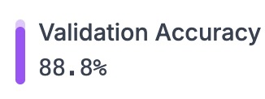

# Классификация архитектурных стилей

Модель предсказывает архитектурный стиль здания по фото.

___
***Попробуйте работу модели:***
1. Телеграм-бот [@ArchitectureTeam4Bot](https://t.me/ArchitectureTeam4Bot)
2. Проект в Roboflow [mipt4/archistyles](https://universe.roboflow.com/mipt4/archistyles/model/1)
3. Пример реализации на выделенном веб-сервере: [https://leadzilla.ru/mipt/hack/1/](https://leadzilla.ru/mipt/hack/1/)
___

## Оглавление
- [Хакатон. Умная городская среда](#хакатон-умная-городская-среда)
  - [Оглавление](#оглавление)
    - [1. Описание проекта](#1-описание-проекта)
    - [2. Какой кейс решаем](#2-какой-кейс-решаем)
    - [3. Этапы работы над проектом](#3-этапы-работы-над-проектом)
    - [4. Краткая информация о данных](#4-краткая-информация-о-данных)
___

**Цель:**

Помочь людям лучше понять городской ландшафт. Модель тренирована в основном на городской архитектуре Западной и Центральной Европы. Расширение модели на другие архитектурные стили является одним из векторов дальнейшего развития проекта.

**Список определяемых стилей:**
В данный момент модель тренирована определять 11 архитектурных стилей:
1. Art Nouveau (Модерн)
2. Baroque (Барокко)
3. Beaux-Arts (Бозар)
4. Byzantine (Византийская)
5. Chicago school (Чикагская архитектурная школа)
6. Deconstructivism (Деконструктивизм)
7. Edwardian (Эдвардианская архитектура)
8. Gothic (Готика)
9. Palladian (Палладианство)
10. Postmodern (Постмодернизм)
11. Romanesque (Романская архитектура)

**Область применения:**

Целью является использование как регионального инструмента, но также возможно глобальное применение. Если модель правильно изучит характеристики каждого архитектурного стиля, ожидается, что она будет функциональна в том числе в мировом масштабе. Так, для эксперимента, модель была дообучена на архитектуре чикагской школы.

**Аудитория:**

Предназначена для широкой публики. В частности может быть использована студентами, туристами или даже разработчиками.

**Идеи:**

Глобально цель заключается в том, чтобы помочь людям лучше понять городской ландшафт.
Использование в экскурсиях для лучшего понимания истории/культуры города. Студенты, обучающиеся за границей, могут использовать её для выполнения заданий. Разработчики могут использовать её при осмотре потенциально интересных объектов.

**[Дальнейшее развитие](#8-векторы-развития-проекта):**
1. Локализация модели по городам. Дать пользователю возможность выбрать город, сузив варианты выбора архитектрурных стилей для модели повышение точности определения.
2. Увеличение количества определяемых архитектурных стилей.
3. Гибкий ответ системы. Когда в ответ пользователю возвращается не 1, а Топ-3 или Топ-5 наиболее вероятных стилей с указанием вероятности каждого. Это нивелирует ошибку модели в том числе при смешении разных стилей.
4. Улучшение данных для обучения модели: очистка и группировка профессиональным архитектором.

:arrow_up: [к оглавлению](#оглавление)
___

## 1. Исходные данные
### 1.1. Предобученная ML-модель
За основу была взята предобученная модель Roboflow [ArchiTective: Architectural Style Image Classification Model Computer Vision Project](https://universe.roboflow.com/test-1-architective-mvp/architective-architectural-style-image-classification-model) со следующими характеристиками:

+ **Тип модели:** Single Label Classification Model
+ **Точность предсказаний:** 89.1%
+ **Классов (архитектурных стилей):** 9
  1. Art Nouveau
  2. Baroque
  3. Beaux-Arts
  4. Byzantine
  5. Deconstructivism
  6. Gothic
  7. Palladian
  8. Postmodern
  9. Romanesque
+ **Размер выборки для каждой категории:** 200

+ **Разметка изображений:** архитектурные стили (фото) разбиты по папкам

+ **Разделение данных:** 88% обучение (3780 изображений), 8% валидация (360 изображений), 4% тестирование (180 изображений)

+ **Медианный размер изображений:** 800x600 px

+ **Предобработка изображений:** Для создания 3 версий каждого исходного изображения применялась следующая аугментация:
  + 50% вероятность горизонтального отражения
  + Случайный сдвиг в диапазоне от -15° до +15° горизонтально и от -15° до +15° вертикально

### 1.2. Дополнительный датасет
Для дообучения модели также были использованы изображения из датасета [Architectural styles](https://www.kaggle.com/datasets/dumitrux/architectural-styles-dataset) с проекта Kaggle. Так в имеющиеся классы были добавлены:
1. Art Nouveau: +615 изображений
2. Baroque: +456 изображений
3. Beaux-Arts: +424 изображения
4. Byzantine: +313 изображений
5. Deconstructivism: +335 изображений
6. Gothic: +331 изображение
7. Palladian: +343 изображения
8. Romanesque: +301 изображение

Также добавлены 2 дополнительных стиля: *Chicago school* (278 изображений) и *Edwardian* (280 изображений)

Все добавленные данные были разбиты на `train` / `test` / `validation` в пропорции `70%` / `20%` / `10%`.

:arrow_up: [к оглавлению](#оглавление)

## 2. Подготовка датасета и его аннотация
Чтобы тренировать YOLOv5 необходимо подготовить собранные данные: разметить изображения и экспортировать их в понятном для YOLOv5 формате. Для этого:

1. Был создан проект в Roboflow (https://app.roboflow.com/mipt4/archistyles) через форк [изначальной модели](https://universe.roboflow.com/test-1-architective-mvp/architective-architectural-style-image-classification-model)

2. Добавлены новые классы (`Chicago School` и `Edwardian`)

3. Загружны дополнительные файлы для каждого архитектурного стиля. Каждый загружаемый пакет изображений (1 пакет = 1 стиль) разбивался на `test`/`train`/`validate` в пропорции 70/20/10%.

4. Итоговый датасет получился на 12 классов, 4914 файлов.

5. **Аннотация** изображений происходила через робофлоу методом загрузки изображений одного класса в папке с названием этого класса.

6. **Препроцессинг** изображений не применялся

7. **Аугументация:** выбрана ротация изображений на 90° влево/вправо, иммитируя снимки телефоном в разной ориентации экрана.

8. **Количество версий изображений:** 3 (при применении аугументации)

**Ссылка на итоговый датасет** с примененной аугументацией: [https://universe.roboflow.com/mipt4/archistyles/dataset/1](https://universe.roboflow.com/mipt4/archistyles/dataset/1)

:arrow_up: [к оглавлению](#оглавление)

## 3. Обучение ML-модели
Обучение проводилось с использованием ресуросов Roboflow.

Модель обучалась через ImageNet Roboflow.
+ **Model Type:** Roboflow 2.0 Classification
+ **Validation accuracy:** 88.8% - точность предсказания модели на валидационных данных

**Примечание:** погрешность может быть обусловлена как самой моделью, так и качеством исходных данных, в которых было обнаружено до 10% нерелевантных изображений. Это один из векторов улучшения предсказательной способности модели.



#### Графы обучения по эпохам:


Видно, что после 11 эпохи особых улучшений модель уже не показывала и обучение было остановлено после 12 эпохи.

**Ссылка на обученную модель** и ее тестирование здесь: [https://universe.roboflow.com/mipt4/archistyles/model/1](https://universe.roboflow.com/mipt4/archistyles/model/1)

___

## 4. Проверка работы модели

### 4.1. Через Roboflow
Заходим в проект [archistyles](https://universe.roboflow.com/mipt4/archistyles/model/1) на Roboflow и загружаем фото в виде файла или ссылки и получаем предсказание


### 4.2. Через телеграм-бота
Еще один вариант взаимодействия с моделью - через телеграм-бота [@ArchitectureTeam4Bot](https://t.me/ArchitectureTeam4Bot). Код реализации бота предоставлен в папке [telegram](/architectural-styles-detection/telegram)


### 4.3. Код обращения к API модели, встроенный в веб-сайт
Также для тестирования/использования был реализован доступ к модели по API через [веб-интерфейс](https://leadzilla.ru/mipt/hack/1/).

В нем можно загрузить как локальный файл с фотографией здания, так и файл по ссылке.
Результат работы модели (предсказание) будет выдан в JSON-формате, что можно доработать и выводить в более user-friendly виде. Либо же использовать JSON ответ сервера для дальнейшей обработки данных.


#### *К примеру, [здание в Готическом стиле](https://lastfm.freetls.fastly.net/i/u/ar0/9e6c790d4ed83ad4a297cf6d50053761.png) модель определила безошибочно:*


### 4.4. Реализация в Python

```python
# Установить модуль roboflow
# %pip install roboflow
from roboflow import Roboflow
import pandas as pd

# Инициализируем класс Roboflow для обращения по API и создаем объект модели
'''
Зарегистрируйтесь в робофлоу для получения PRIVATE_API_KEY
https://docs.roboflow.com/api-reference/authentication#retrieve-an-api-key
'''
PUBLIC_API_KEY = 'your_api_key'
rf = Roboflow(api_key=PUBLIC_API_KEY)
project = rf.workspace("mipt4").project("archistyles")
model = project.version(1).model

# Делаем предсказание на базе локального файла
img_to_predict = 'images/gotic_building.jpg'
predict = model.predict(img_to_predict)

# Выводим результаты предсказания
# Извлекаем predictions
df = pd.DataFrame(predict.predictions[0]["predictions"])

# Добавляем нужные колонки и переименовываем
df = df.rename(columns={"class": "Стиль", "confidence": "Вероятность, %"})
df["Вероятность, %"] = df["Вероятность, %"] * 100  # Перевод в проценты

# Сортировка по убыванию вероятности
df = df.sort_values(by="Вероятность, %", ascending=False).reset_index(drop=True).nlargest(n=5, columns="Вероятность, %")

# Переупорядочиваем колонки
df = df[["Стиль", "Вероятность, %"]]

# Вывод результата
display(df)
```


## 5. Дообучение модели через Roboflow
Дообучение модели возможно по описанной выше схеме через интерфейс Roboflow (инструкция), либо использовать RoboFlow только для более удобной разметки изображений, а затем по API выгрузить их и обучить на этих данных, к примеру, модель классификации YOLOv5, используя собственные или облачные (к примеру Google Collab) вычислительные мощности.

## 6. Переобучения и fine-tuning модели через YOLOv5
Можно использовать готовый датасет из Roboflow для обучения на нем классификатора YOLOv5 для работы с гиперпараметрами и возможности получения лучшей предсказательной способности модели. Пример реализации смотрите в папке: [yolov5](/architectural-styles-detection/yolov5)

## 7. Способы повышения точности работы модели
1. **Очистка датасета.**
    
    В ходе реализации проекта были обнаружены некоторые неточности датасета. Так в одной папке конкретного архитектурного стиля могли находиться в фотографии зданий, не принадлежащих данному стилю. По примерным оценкам погрешность не превышает 10%. Скорее всего потому, что изначальный датасет собирался из Google Images, экспертиза которого под вопросом. Если выверить фотографии каждого архитектурного стиля с помощью профессионального архитектора, это поможет модели обучиться более качественно.

2. **Если в архитектуре сразу несколько стилей.**
    
    Также здания могут содержать в себе несколько разных архитектурных стилей. В этом случае модель должна будет выдать несколько почти равновероятных стилей, которые она сумеет распознать.

3. **Неизвестные архитектурные стили и некорректные фото.**
    
    В настоящее время модель обучена определять только 11 стилей, наиболее популярных в Западно-Европейской архитектуре. Если на фото будет присутствовать здание другого стиля, модель может некорректно определить стиль, попытавшись найти наиболее похожий на известный ей стиль.

    Если же попросить модель предсказать архитектурный стиль, к примеру, яблока, котика или др. неархитектурного фото, она попытается это сделать и выдать в ответ какой-то известный архитектурный стиль. Но уверенность (вероятность) присвоения этому стилю будет низкой (значительно ниже 90%).

    

##  8. Векторы развития проекта

1. **Реализация локальных версий**. Поскольку архитектура разных городов может значительно отличаться, можно "помочь" модели допускать меньше ошибок. Чтобы она не искала в этом городе архитектурные стили, которых в нем попросту нет (к примеру, бесполезно искать в Санкт-Петербурге архитектуру Чикагской школы). Предоставить пользователю перед предсказанием выбрать город, в котором он находится.

2. **Увеличение количества определяемых архитектурных стилей.** Аналогично добавлению нами класса Чикагской архитектурной школы и Эдвардианского стиля можно дообучить модель определять гораздо больше стилей. При этом особое внимание требует уделять качеству собираемых фотографий и их реальному соответствию заданным классам. Желательно при этом подбирать фото несмешанных стилей, чтобы модель могла однозначно отделять элементы одного стиля от другого.

3. **Вывод таблицы нескольких стилей.** Реализовать вывод для пользователя не 1 наиболее вероятного стиля, а таблицы из ТОП-5 наиболее вероятных стилей, упорядоченной по убыванию вероятностей. Как в п.п. [3.2.4. Реализация в Python](#3.2.4.-Через-Python) Так для зданий, в стиле которых присутствует смешение стилей можно будет показать какие это стили, а также повысить точность — даже если модель некорректно укажет основной стиль, то в дополнительных стилях правильный стиль будет присутствовать с вероятностью более 95%:


4. **Повышение предсказательной точности.** Привлечь архитектора для выверки датасета в целях повышения качества обучения модели и уменьшения мусора в данных.